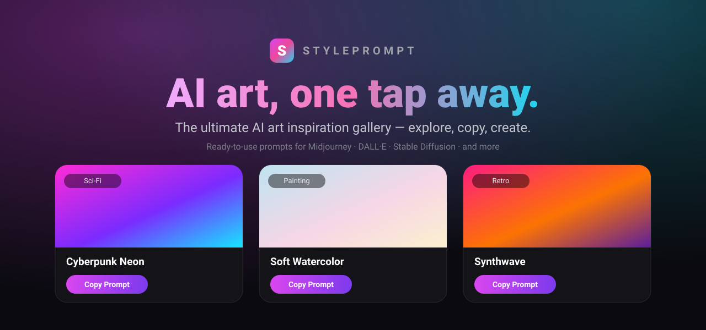

<div align="center">



# StylePrompt

**The ultimate AI art inspiration gallery.** Browse a clean gallery of beautiful art styles — each with a ready-to-use prompt. Tap **Copy Prompt** and paste straight into Midjourney, DALL·E, Stable Diffusion, or any AI generator. No typing, no guessing — just explore, copy, and create.

[](./LICENSE)
[](https://react.dev)
[](https://vite.dev)
[](https://www.typescriptlang.org)
[](https://tailwindcss.com)
[](#-contributing)

[Deploy](#-deploy) · [Quick start](#-quick-start) · [Add your own images](#-add-your-own-example-images) · [Contributing](#-contributing)

</div>

---

## ✨ Features

- 🎨 **30+ curated art styles** — Cyberpunk Neon, Soft Watercolor, Classical Oil, Anime, Surrealism, Vaporwave, Art Deco, Ukiyo-e, Synthwave, Stained Glass, Bauhaus, and many more.
- 📋 **One-tap copy** — every card has a **Copy Prompt** button with instant "Copied!" feedback and a toast.
- 🔍 **Live search & filters** — search by name, mood, or keyword, and filter by category chips.
- 🖼️ **Self-illustrating gallery** — each card generates unique gradient art from the style's palette, so it looks complete out of the box and **auto-upgrades** the moment you drop in real images.
- ⚡ **Fast & static** — no backend, no API keys, no runtime AI. Pure client-side React, deployable anywhere.
- 📱 **Responsive & accessible** — mobile-first 1→4 column grid, keyboard-friendly, reduced-motion aware, dark gallery aesthetic.

## 🖼️ Preview

The banner above is rendered from the app's own design language. Cards show the example art on top, the style name and category, the full prompt, and a gradient **Copy Prompt** button — exactly what you get when you run it locally.

## 🚀 Quick start

```bash
# 1. Install dependencies
npm install

# 2. Start the dev server (http://localhost:5173)
npm run dev

# 3. Build for production
npm run build

# 4. Preview the production build locally
npm run preview
```

> Requires **Node 22+**.

## 🧩 Tech stack

| Layer      | Choice                          |
| ---------- | ------------------------------- |
| Framework  | React 18                        |
| Build tool | Vite 6                          |
| Language   | TypeScript 5 (strict)           |
| Styling    | Tailwind CSS v4 (`@tailwindcss/vite`) |
| Hosting    | Static — works on Netlify, Vercel, GitHub Pages, Cloudflare Pages… |

## 🗂️ Project structure

```
StylePrompter/
├─ public/
│  ├─ favicon.svg
│  └─ styles/              # drop real example images here (<id>.jpg)
├─ src/
│  ├─ components/
│  │  ├─ Header.tsx        # hero + tagline
│  │  ├─ Toolbar.tsx       # search bar + category filter chips
│  │  ├─ StyleCard.tsx     # a single gallery card
│  │  ├─ StyleArt.tsx      # image with gradient-art fallback
│  │  └─ Toast.tsx         # "copied" confirmation
│  ├─ data/styles.ts       # the art-style catalog (edit me!)
│  ├─ hooks/useCopyToClipboard.ts
│  ├─ App.tsx              # state, filtering, layout
│  └─ index.css            # Tailwind + base styles + keyframes
├─ docs/banner.svg
├─ netlify.toml
└─ index.html
```

## 🎨 Add your own example images

Every card tries to load `/styles/<id>.jpg` and falls back to generated gradient art when the file is missing — so the gallery is always complete and upgrades itself as you add images.

1. Generate (or source) an image for a style.
2. Save it in `public/styles/` named after the style's `id` from [`src/data/styles.ts`](./src/data/styles.ts), e.g. `cyberpunk-neon.jpg`.
3. That card automatically switches from gradient art to your real image. ✨

**Adding a brand-new style?** Append an entry to the `styleData` array in [`src/data/styles.ts`](./src/data/styles.ts) — give it an `id`, `name`, `category`, `description`, `prompt`, `tags`, and a `palette` (2–4 hex colors that drive its fallback art). That's it.

## 🌐 Deploy

This is a static site — point any host at `npm run build` with a publish directory of `dist`.

[](https://app.netlify.com/start/deploy?repository=https://github.com/ZPARXMarketing/StylePrompter)

A [`netlify.toml`](./netlify.toml) is included with the build command, Node version, SPA fallback, and asset caching already configured. For Vercel/Cloudflare Pages, use build command `npm run build` and output directory `dist`.

## 🛣️ Roadmap

- [ ] Real example images for every style
- [ ] Copy variants (e.g. with/without aspect-ratio flags per generator)
- [ ] Favorites / "my prompts" saved locally
- [ ] Shareable deep links to a single style

## 🤝 Contributing

Contributions are welcome! Great first PRs:

- Add a new art style (one object in `src/data/styles.ts`).
- Contribute real example images under `public/styles/`.
- Polish UI, accessibility, or animations.

Please run `npm run build` before opening a PR so the type-check and production build pass.

## 📄 License

[MIT](./LICENSE) © ZPARX Marketing

<div align="center"><sub>Built with React, Vite, TypeScript & Tailwind. Explore, copy, create. 🎨</sub></div>
